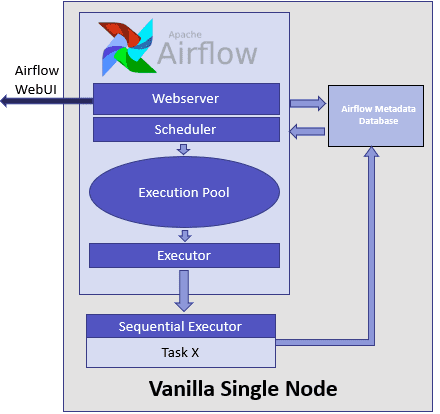

# Airflow 任务调度系统 - 实战


## 1. 架构和组件

### 1. 介绍

#### 1. Airflow 是什么

Airflow 是由 Python 语言编写的.

Airflow 是一个<u>编排</u>、<u>调度</u>和<u>监控</u> workflow 的平台，由 Airbnb 公司 2014年10月 开源，2019年1月从 Apache 基金会毕业，成为新的 Apache 顶级项目。

Airflow 将 workflow 编排为 tasks 组成的 DAGs，调度器在一组 workers 上按照指定的依赖关系执行 tasks。同时，Airflow 提供了丰富的命令行工具和简单易用的用户界面以便用户查看和操作，并且 Airflow 提供了监控和报警系统。

Airflow 使用 DAG (有向无环图) 来定义工作流，配置作业依赖关系非常方便，从管理方便和使用简单角度来讲，Airflow 远超过其他的任务调度工具。


重点词汇：

- 编排：任务间的依赖关系
- 调度：时间调度 和 任务调度；通过控制 Broker 不同 Queue，来分发任务执行
- 监控：DAGs 和 Task 的的状态


#### 2. Airflow 优势


**Scalable 可伸缩的**

Airflow 有一个模块化的架构 和 使用一个消息队列来编排任意数量的Worker，可以做到无限扩展。


**Dynamic 动态的**

Airflow 的 pipeline 使用Python定义的，允许动态生成 pipeline ，这允许实现动态化的 pipeline 代码。


**Extensible 可扩展的**

轻松定义你自已的 operators，扩展库适配你的环境。


**Elegant 优雅的**

Airflow 的 pipeline 简单明了，使用强大的 JinJa 模版引擎。


### 2. 架构

#### 1. 开发环境架构



  

#### 2. 分布式架构


- 【Web Server】

【Web Server】是一个Flask启动的Web服务，核心提供【Metadata Database】的快速操作控制台；

【Web Server】服务在启动时依赖 airflow.cfg 配置文件 和 【Metadata Database】数据库。


- 【Scheduler】

【Scheduler】是一个LOOP守护进程（一直循环），它在启动的时候依赖 airflow.cfg 配置文件，DAGs 目录 和 【Metadata Database】数据库。

如果有任务要执行（定时任务触发(手动触发)，外部触发，backfill），它会调用 Executor，不同的 Executor 会有不同的执行逻辑；

如果是 Sequential Executor，则是顺序通过单进程（上个任务没执行完不会执行下一个）的方式来执行任务并更新任务的状态；

如果是 Celery Executor，则是把要执行的任务（可以并行）先发送到 Broker，然后 Worker 从 Broker 消费任务并执行，并把执行结果在更新到 【result_backend】中，【Scheduler】在loop【result_backend】 更新到【Metadata Database】。


- 【Worker】

【Worker】是真正意义上执行任务的，并把任务的执行结果写到【result_backend】中；

服务在启动时依赖 airflow.cfg 配置文件，DAGs 目录 和 Broker。


- 【Broker】

【Broker】是一个消息中间件，可以是Redis/ RabbitMQ/...， 是跨主机通信常用的一种方式。


- [1] **Web server** –> **Workers** - 获取任务的执行日志
- [2] **Web server** –> **DAG files** - 展示 DAG 结构
- [3] **Web server** –> **Database** - 获取任务的状态
- [4] **Workers** –> **DAG files** - 展示DAG 结构 和 执行任务
- [5] **Workers** –> **Database** - 获取 和 存储有关连接配置，变量和XCOM信息
- [6] **Workers** –> **Celery’s result backend** - 保存任务的执行状态
- [7] **Workers** –> **Celery’s broker** - 存储用于执行的命令
- [8] **Scheduler** –> **DAG files** - 展示DAG 结构并执行任务
- [9] **Scheduler** –> **Database** - 存储一个DAG和相关联的任务
- [10] **Scheduler** –> **Celery’s result backend** - 获取已完成任务的状态信息
- [11] **Scheduler** –> **Celery’s broker** - 放置要执行的命令


#### 3. 组件


**Scheduler**

- 最核心的组件，负责编排任务
- 调度器是一个持久化的服务，用于监控DAG和任务，并触发满足依赖关系的任务实例；
- 调度器负责调用 Airflow 配置中定义的执行器。


**Executor**

- 是任务实例运行的机制。Airflow 默认提供不同类型的执行器，您可以定义自定义执行器，例如 Kubernetes 执行器。


**Broker**

- 将消息（要执行的任务请求）排队，并充当 executor 和 worker 之间的通信器。


**Workers**

- 执行任务并返回任务结果的实际节点。


**MySQL**

- 存储与 DAGs、DAG 运行、任务、变量和连接相关的所有元数据的数据库。


**Webserver**

- 运行一个 Flask 应用程序，它从元数据数据库中读取所有任务的状态，并将这些状态呈现给 Web UI。


**Web UI**

- 可用于概览不同有向无环图 (DAG) 的整体健康状况，还有助于可视化每个 DAG 的不同组件和状态。
- 提供了为 设置管理用户、角色和不同配置的能力。


**Flower**

- Flower是基于web的监控和管理Celery的工具

  

**Execution Logs**

- worker 进程写日志存储到本地磁盘上 或 远程到对象存储上（比如S3）；
- Web 服务器访问日志并使它们可用于 Web UI

### 3. 调度器的工作原理

#### 1. 案列: 触发 Dag 完整流程

##### 1. 手动触发 DAG


##### 2. 查看【scheduler】的日志

```bash
// (1) 1个待执行的任务 demo_test.print_date
[2021-07-17 22:14:12,129] {scheduler_job.py:947} INFO - 1 tasks up for execution:
	<TaskInstance: demo_test.print_date 2021-07-17 14:14:11.188164+00:00 [scheduled]>
[2021-07-17 22:14:12,131] {scheduler_job.py:981} INFO - Figuring out tasks to run in Pool(name=default_pool) with 128 open slots and 1 task instances ready to be queued
[2021-07-17 22:14:12,131] {scheduler_job.py:1008} INFO - DAG demo_test has 0/16 running and queued tasks

// (2) 设置任务(demo_test.print_date)的默认状态 scheduled
[2021-07-17 22:14:12,131] {scheduler_job.py:1069} INFO - Setting the following tasks to queued state:
	<TaskInstance: demo_test.print_date 2021-07-17 14:14:11.188164+00:00 [scheduled]>
	
// (3) 发送 task(demo_test.print_date) 到 优先级为3并且 default 队列的 executor 上	
[2021-07-17 22:14:12,132] {scheduler_job.py:1111} INFO - Sending TaskInstanceKey(dag_id='demo_test', task_id='print_date', execution_date=datetime.datetime(2021, 7, 17, 14, 14, 11, 188164, tzinfo=Timezone('UTC')), try_number=1) to executor with priority 3 and queue default
[2021-07-17 22:14:12,132] {base_executor.py:82} INFO - Adding to queue: ['airflow', 'tasks', 'run', 'demo_test', 'print_date', '2021-07-17T14:14:11.188164+00:00', '--local', '--pool', 'default_pool', '--subdir', '/root/airflow/dags/demo_test.py']
[2021-07-17 22:14:12,137] {scheduler_job.py:1212} INFO - Executor reports execution of demo_test.print_date execution_date=2021-07-17 14:14:11.188164+00:00 exited with status queued for try_number 1
[2021-07-17 22:14:12,141] {scheduler_job.py:1232} INFO - Setting external_id for <TaskInstance: demo_test.print_date 2021-07-17 14:14:11.188164+00:00 [queued]> to 73194c45-35bc-4a2a-81fb-3a95c3c50ceb

// (4 ) 2个待执行的任务 demo_test.sleep 和 demo_test.templated
[2021-07-17 22:14:13,274] {scheduler_job.py:947} INFO - 2 tasks up for execution:
	<TaskInstance: demo_test.sleep 2021-07-17 14:14:11.188164+00:00 [scheduled]>
	<TaskInstance: demo_test.templated 2021-07-17 14:14:11.188164+00:00 [scheduled]>
[2021-07-17 22:14:13,276] {scheduler_job.py:981} INFO - Figuring out tasks to run in Pool(name=default_pool) with 128 open slots and 2 task instances ready to be queued
[2021-07-17 22:14:13,276] {scheduler_job.py:1008} INFO - DAG demo_test has 0/16 running and queued tasks
[2021-07-17 22:14:13,276] {scheduler_job.py:1008} INFO - DAG demo_test has 1/16 running and queued tasks

// (5 ) 设置任务(demo_test.sleep/ demo_test.templated)的默认状态 scheduled
[2021-07-17 22:14:13,276] {scheduler_job.py:1069} INFO - Setting the following tasks to queued state:
	<TaskInstance: demo_test.sleep 2021-07-17 14:14:11.188164+00:00 [scheduled]>
	<TaskInstance: demo_test.templated 2021-07-17 14:14:11.188164+00:00 [scheduled]>
	
// (4 ) 发送 task(demo_test.sleep) 到 优先级为1并且 default 队列的 executor 上		
[2021-07-17 22:14:13,278] {scheduler_job.py:1111} INFO - Sending TaskInstanceKey(dag_id='demo_test', task_id='sleep', execution_date=datetime.datetime(2021, 7, 17, 14, 14, 11, 188164, tzinfo=Timezone('UTC')), try_number=1) to executor with priority 1 and queue default
// (4 ) 添加 命令到 队列
[2021-07-17 22:14:13,278] {base_executor.py:82} INFO - Adding to queue: ['airflow', 'tasks', 'run', 'demo_test', 'sleep', '2021-07-17T14:14:11.188164+00:00', '--local', '--pool', 'default_pool', '--subdir', '/root/airflow/dags/demo_test.py']
// 发送 task(demo_test.templated) 到 优先级为1并且 default 队列的 executor 上
[2021-07-17 22:14:13,279] {scheduler_job.py:1111} INFO - Sending TaskInstanceKey(dag_id='demo_test', task_id='templated', execution_date=datetime.datetime(2021, 7, 17, 14, 14, 11, 188164, tzinfo=Timezone('UTC')), try_number=1) to executor with priority 1 and queue default
// 添加 命令到 队列
[2021-07-17 22:14:13,279] {base_executor.py:82} INFO - Adding to queue: ['airflow', 'tasks', 'run', 'demo_test', 'templated', '2021-07-17T14:14:11.188164+00:00', '--local', '--pool', 'default_pool', '--subdir', '/root/airflow/dags/demo_test.py']

// (4 ) 报告事件, demo_test.sleep 状态在队列中
[2021-07-17 22:14:13,291] {scheduler_job.py:1212} INFO - Executor reports execution of demo_test.sleep execution_date=2021-07-17 14:14:11.188164+00:00 exited with status queued for try_number 1
// 报告事件, demo_test.templated 状态在队列中
[2021-07-17 22:14:13,291] {scheduler_job.py:1212} INFO - Executor reports execution of demo_test.templated execution_date=2021-07-17 14:14:11.188164+00:00 exited with status queued for try_number 1
// (4 ) 报告事件, demo_test.print_date 执行完成
[2021-07-17 22:14:13,291] {scheduler_job.py:1212} INFO - Executor reports execution of demo_test.print_date execution_date=2021-07-17 14:14:11.188164+00:00 exited with status success for try_number 1
[2021-07-17 22:14:13,297] {scheduler_job.py:1232} INFO - Setting external_id for <TaskInstance: demo_test.sleep 2021-07-17 14:14:11.188164+00:00 [queued]> to 11930274-0b89-4633-929e-e3a1ad08222f
[2021-07-17 22:14:13,297] {scheduler_job.py:1232} INFO - Setting external_id for <TaskInstance: demo_test.templated 2021-07-17 14:14:11.188164+00:00 [queued]> to 36660763-e17a-44dd-bae1-d8e41b516975

// (4 ) 报告事件, demo_test.templated 执行完成
[2021-07-17 22:14:14,467] {scheduler_job.py:1212} INFO - Executor reports execution of demo_test.templated execution_date=2021-07-17 14:14:11.188164+00:00 exited with status success for try_number 1


// (4 ) Dag执行完成，并更新dag_run表里的数据
[2021-07-17 22:14:19,260] {dagrun.py:444} INFO - Marking run <DagRun demo_test @ 2021-07-17 14:14:11.188164+00:00: manual__2021-07-17T14:14:11.188164+00:00, externally triggered: True> successful

// (4 ) 报告事件, demo_test.sleep 执行完成
[2021-07-17 22:14:19,279] {scheduler_job.py:1212} INFO - Executor reports execution of demo_test.sleep execution_date=2021-07-17 14:14:11.188164+00:00 exited with status success for try_number 1
```


##### 3. 查看【Database】数据库

每触发一次 Dag 执行， 就会在 dag_run 表里创建一条记录 和 task_instance 表里创建N(task的数量)条记录，如下图

- dag_run 表


- task_instance 表


##### 4. 查看【Redis】数据库

###### 1. 查看 Broker 的 queue 


> CeleryExecutor 发送 Task 到 queue的default 队列


###### 2. 查看 Result_backend


##### 5. 查看【Worker】消费任务并执行

**先看Worker 日志**

```bash
// 接收任务，任务ID
[2021-07-17 22:14:12,136: INFO/MainProcess] Received task: airflow.executors.celery_executor.execute_command[73194c45-35bc-4a2a-81fb-3a95c3c50ceb]
// 要执行的命令
[2021-07-17 22:14:12,137: INFO/ForkPoolWorker-15] Executing command in Celery: ['airflow', 'tasks', 'run', 'demo_test', 'print_date', '2021-07-17T14:14:11.188164+00:00', '--local', '--pool', 'default_pool', '--subdir', '/root/airflow/dags/demo_test.py']
[2021-07-17 22:14:12,181: INFO/ForkPoolWorker-15] Filling up the DagBag from /root/airflow/dags/demo_test.py

// 运行任务
[2021-07-17 22:14:12,289: WARNING/ForkPoolWorker-15] Running <TaskInstance: demo_test.print_date 2021-07-17T14:14:11.188164+00:00 [queued]> on host apache-airflow-server

// 花 x 秒 任务执行成功
[2021-07-17 22:14:12,474: INFO/ForkPoolWorker-15] Task airflow.executors.celery_executor.execute_command[73194c45-35bc-4a2a-81fb-3a95c3c50ceb] succeeded in 0.3378896340727806s: None

// 同上
[2021-07-17 22:14:13,292: INFO/MainProcess] Received task: airflow.executors.celery_executor.execute_command[11930274-0b89-4633-929e-e3a1ad08222f]
[2021-07-17 22:14:13,294: INFO/MainProcess] Received task: airflow.executors.celery_executor.execute_command[36660763-e17a-44dd-bae1-d8e41b516975]
[2021-07-17 22:14:13,297: INFO/ForkPoolWorker-15] Executing command in Celery: ['airflow', 'tasks', 'run', 'demo_test', 'sleep', '2021-07-17T14:14:11.188164+00:00', '--local', '--pool', 'default_pool', '--subdir', '/root/airflow/dags/demo_test.py']
[2021-07-17 22:14:13,299: INFO/ForkPoolWorker-16] Executing command in Celery: ['airflow', 'tasks', 'run', 'demo_test', 'templated', '2021-07-17T14:14:11.188164+00:00', '--local', '--pool', 'default_pool', '--subdir', '/root/airflow/dags/demo_test.py']
[2021-07-17 22:14:13,348: INFO/ForkPoolWorker-15] Filling up the DagBag from /root/airflow/dags/demo_test.py
[2021-07-17 22:14:13,358: INFO/ForkPoolWorker-16] Filling up the DagBag from /root/airflow/dags/demo_test.py
[2021-07-17 22:14:13,513: WARNING/ForkPoolWorker-15] Running <TaskInstance: demo_test.sleep 2021-07-17T14:14:11.188164+00:00 [queued]> on host apache-airflow-server
[2021-07-17 22:14:13,528: WARNING/ForkPoolWorker-16] Running <TaskInstance: demo_test.templated 2021-07-17T14:14:11.188164+00:00 [queued]> on host apache-airflow-server
[2021-07-17 22:14:13,737: INFO/ForkPoolWorker-16] Task airflow.executors.celery_executor.execute_command[36660763-e17a-44dd-bae1-d8e41b516975] succeeded in 0.44165975600481033s: None
[2021-07-17 22:14:18,724: INFO/ForkPoolWorker-15] Task airflow.executors.celery_executor.execute_command[11930274-0b89-4633-929e-e3a1ad08222f] succeeded in 5.430249652825296s: None
```


##### 6. 再次查看【Database】

###### 1. dag_run 表

**三个核心字段**

- state (running -> suecess)

- end_date (NULL -> current_time)

- last_scheduling_decision (x -> finish_time )


###### 2. task_instance 表

**五个核心字段**

- start_date

- end_date

- duration

- state (queued -> success)

- external_executor_id


#### 2. 总结

##### 1. 流程图概述


1. 【scheduler】 会在 mysql 数据库中的 dag_run 表创建 dag记录 和 task_instance 创建 任务记录
2. 【scheduler】调用【CeleryExecutor】会把要执行的任务命令信息写入到 Broker 的 default 队列中
3. 【Worker】 从 Broker 的 default 队列中消费任务并执行，把执行的结果写入到 result_backend 中，key就是external_executor_id，值就是完成时间等
4. 【scheduler】Loop会读取 result_backend 任务执行结果并更新 mysql 数据库中

