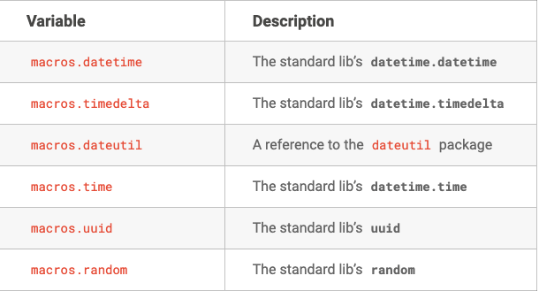

# Airflow 任务调度系统 - 实战

## 4. 名词介绍和用途

> Airflow 有哪些专有名词 和 如何使用？


#### 1. Dag && Task && Pipeline


**Dag**

一个无环的[有向图](https://baike.baidu.com/item/有向图)称做有向无环图（Directed Acyclic Graph），简称 DAG 图。


如果一个[有向图](https://baike.baidu.com/item/有向图)无法从某个顶点出发经过若干条边回到该点，则这个图是一个**有向无环图**（DAG图）


Dag 本质上就是 Dag类的对象。

https://baike.baidu.com/item/%E6%9C%89%E5%90%91%E6%97%A0%E7%8E%AF%E5%9B%BE/10972513?fr=aladdin


定义dag，就是实例化DAG类。


**Task**


Task 本质上就是 Operator 类的对象。


定义task，就是实例化 BashOperator(Operator) 类


**Pipeline**

流水线 （类 Jenkins）

Task 之间的依赖关系


定义Pipeline，就是用箭头，符号指明顺序


#### 2. XComs

##### 1. 概念

XComs 全称 `cross-communications` 交叉通信

是一种让[任务](https://airflow.apache.org/docs/apache-airflow/stable/concepts/tasks.html)相互通信的机制，因为默认情况下任务是完全隔离的，并且可能运行在完全不同的机器上。

##### 2. 语法


###### xcom_push

```bash
# 从当前任务中 Push key/value
value = task_instance.xcom_push(key, value)  # (string, Any)
```

###### xcom_pull

```bash
# 从 pushing_task 任务拉取所有的 key/value
value = task_instance.xcom_pull(task_ids=task_id)

# 从 pushing_task 任务拉取指定key的value
value = task_instance.xcom_pull(task_ids=task_id, key=string')
```

##### 3. 例子

https://airflow.apache.org/docs/apache-airflow/stable/tutorial_taskflow_api.html?highlight=xcom_push

_airflow/example_dags/tutorial_etl_dag.py_

```python
import json
from textwrap import dedent

from airflow import DAG


from airflow.operators.python import PythonOperator
from airflow.utils.dates import days_ago

default_args = {
    'owner': 'airflow',
}
with DAG(
    'tutorial_etl_dag',
    default_args=default_args,
    description='ETL DAG tutorial',
    schedule_interval=None,
    start_date=days_ago(2),
    tags=['example'],
) as dag:
  
    
    # 1. 提取
    def extract(**kwargs): # kwargs 是上下文 context {}
        ti = kwargs['ti']
        data_string = '{"1001": 301.27, "1002": 433.21, "1003": 502.22}'
        ti.xcom_push('order_data', data_string)
        
    # 2. 转换    
    def transform(**kwargs):
        ti = kwargs['ti']
        extract_data_string = ti.xcom_pull(task_ids='extract', key='order_data')
        order_data = json.loads(extract_data_string)

        total_order_value = 0
        for value in order_data.values():
            total_order_value += value

        total_value = {"total_order_value": total_order_value}
        total_value_json_string = json.dumps(total_value)
        ti.xcom_push('total_order_value', total_value_json_string)
    
    # 3. 加载
    def load(**kwargs):
        ti = kwargs['ti']
        total_value_string = ti.xcom_pull(task_ids='transform', key='total_order_value')
        total_order_value = json.loads(total_value_string)

        print(total_order_value)
        
    extract_task = PythonOperator(
        task_id='extract',
        python_callable=extract,
    )

    transform_task = PythonOperator(
        task_id='transform',
        python_callable=transform,
    )

    load_task = PythonOperator(
        task_id='load',
        python_callable=load,
    )

    extract_task >> transform_task >> load_task
```


##### 4. UI 管理


#### 3. Variables

##### 1. 概念

变量是 Airflow 的运行时配置概念 - 一个通用的键/值存储，它是全局的，可以从您的任务中查询，并且可以通过 Airflow 的用户界面轻松设置，或作为 JSON 文件批量上传。


xcoms 作用域是一个 DAG

Variabels 作用域是所有的 DAG

##### 2. 语法

**自定义变量**

```python
from airflow.models import Variable

# Sets a value for an Airflow Variable with a given Key
# serialize_json 
#  - True json.dumps()
#  - False str()
Variable.set(key:str, value:Any, serialize_json:bool=False, session:sqlalchemy.orm.session.Session=None)

# Gets a value for an Airflow Variable Key
Variable.get(key:str, default_var:Any=<object object at 0x7f06c817dd90>, deserialize_json:bool=False)

# Delete an Airflow Variable for a given key
Variable.delete(key:str, session:sqlalchemy.orm.session.Session=None)
```


**默认变量**

[默认的变量在JinJa2的定义和用法](https://airflow.apache.org/docs/apache-airflow/stable/macros-ref.html?highlight=macros#id1)

##### 3. 例子

```python
from airflow.models import Variable


# ***************************** SET *************************
Variable.set("foo", "learn airflow course.")

Variable.set("bar",  {"name":"xiaowang", "age":25})

Variable.set("bar2",  {"name":"xiaowang", "age":25}, serialize_json=True)


# ***************************** GET *************************
# Normal call style
foo = Variable.get("foo")

# Auto-deserializes a JSON value
bar = Variable.get("bar", deserialize_json=True)

# Returns the value of default_var (None) if the variable is not set
baz = Variable.get("baz", default_var=None)


# ***************************** DELETE *************************
Variable.delete("bar2")
```


在 templates 中使用 Variables 语法

```bash
# Raw value
echo {{ var.value.<variable_name> }}

# Auto-deserialize JSON value
echo {{ var.json.<variable_name> }}
```


实战

```python
    templated_command = dedent(
        """
    
        echo ds: "{{ ds }}"                                                          # 执行的日期 格式YYYY-MM-DD
        echo ds_add: "{{ macros.ds_add(ds, 7)}}"                   # 在执行日期上加7天
        echo my_param: "{{ params.my_param }}"                  # BashOperator的参数 params
    

    echo "{{ var.value.op1 }}"                                                 # 通过 Variable 定义的变量
    echo "{{ var.value.foo }}"
    echo "{{ var.value.op4 }}"                                                 # 无法使用 var.value.op4.name
    
    echo "{{ var.json.op4 }}"                                                   # 自动反序列化 json 对象 json.loads(op4)
    echo "{{ var.json.op4.name }}"                                         # 通过key获取值

    """

    t3 = BashOperator(
        task_id='templated',
        depends_on_past=False,
        bash_command=templated_command,
        params={'my_param': 'Parameter I passed in'},
    )

```


##### 4. UI 管理


#### 4. DagRun

##### 1. 概念

一个 DAG Run 表示 DAG 在时间上的实例化对象，换句话来说 就是 dag_run 表里的一条记录。

以下几种情况会产生 DagRun

- Re-run DAG (DAG 运行失败，需要重新运行DAG)
- Catchup (追赶。表示启动任务时，是否将任务 start_date 开始的所有未执行的周期任务都补执行一遍。true为开启，如果启用可能会一下子拉起很多dag run；false为禁用，如果禁用，任务开启时仅执行最近一次需要执行的任务（当前时间的上一周期时间点，比如每天凌晨1点执行的任务，那么当前任务的执行时间为上一天凌晨一点))
- backfill （回填。把历史未被执行过的任务在指定的时间内执行一遍，如果已经执行过，那么即使 backfill 也不会执行。）
- Re-run Tasks （任务失败，重新运行Task）
- External Triggers（外部触发，比如）

#### 5. macros

##### 1. 概念

<u>变量</u> 和 <u>宏</u> 可以在模板中使用 [Jinja2](https://airflow.apache.org/docs/apache-airflow/stable/concepts/operators.html#concepts-jinja-templating) ,本章节重点阐述 宏。


更多参考文档: https://airflow.apache.org/docs/apache-airflow/stable/macros-ref.html?highlight=macros


##### 2. 语法


宏暴露对象在你的模版中，在模版的宏命名空间有效。
一些常见的变量和方法





https://github.com/apache/airflow/blob/8505d2f0a4/airflow/macros/__init__.py

##### 3. 例子


```python
    # 一组模版化的脚本
    templated_command = dedent(
        """
        
        echo "{{ macros.uuid.uuid1().hex}}"
        echo "{{ macros.random()}}"
        #echo "{{ macros.random.randint(0, 10)}}"
        echo "{{ macros.ds_add(ds, 7)}}"
        
    """
    )

    t3 = BashOperator(
        task_id='templated',
        depends_on_past=False,
        bash_command=templated_command,                # 要执行的命令
        priority_weight=1,
    )
```


