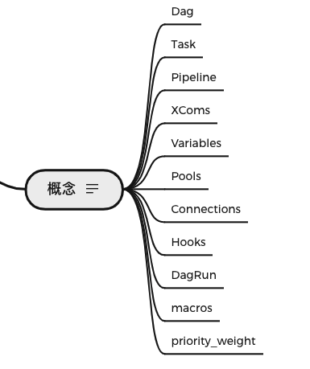
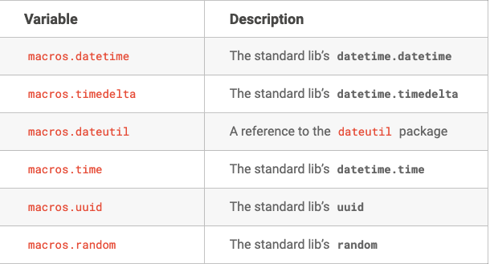
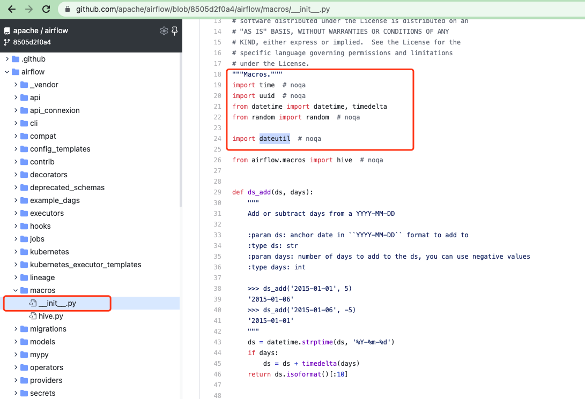
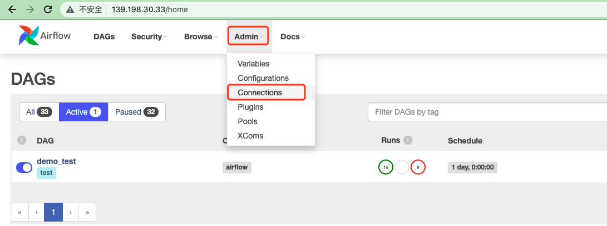
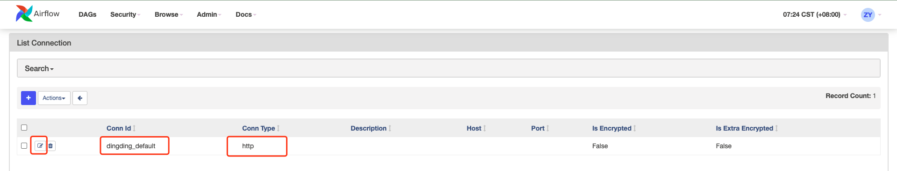
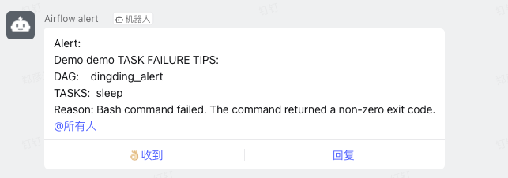
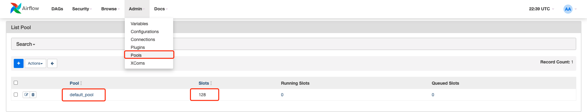
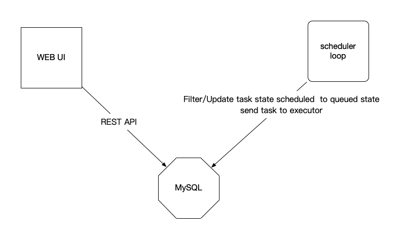
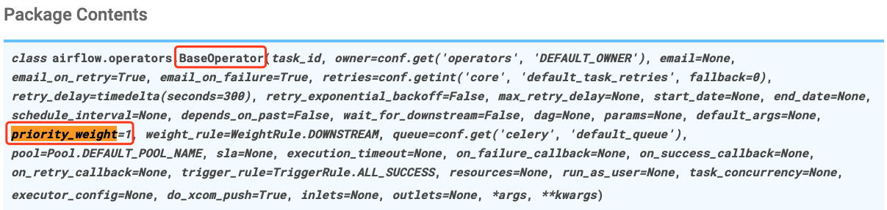

# Airflow 任务调度系统 - 实战

## 4. 名词介绍和用途

> Airflow 有哪些专有名词 和 如何使用？




#### 5. macros

##### 1. 概念

<u>变量</u> 和 <u>宏</u> 可以在模板中使用 [Jinja2](https://airflow.apache.org/docs/apache-airflow/stable/concepts/operators.html#concepts-jinja-templating) , 本章节重点阐述 宏。


更多参考文档: https://airflow.apache.org/docs/apache-airflow/stable/macros-ref.html?highlight=macros


##### 2. 语法

###### 1. 一些常见的库和方法





> 以下截图来自于 https://github.com/apache/airflow/blob/8505d2f0a4/airflow/macros/__init__.py
>
> 从代码中可以看出来， <一些常见的库和方法>是直接用Python内置的标准库 并没有做任何改造，因此可以直接按标准库在Template中使用




###### 2. 一些特殊宏

**ds_add**

- 语法

```python
airflow.macros.ds_add(ds, days)

# Add or subtract days from a YYYY-MM-DD 
# 从一个 YYYY-MM-DD  日期上添加和减去天数
```


特殊的宏共有6个 地址如下

https://github.com/apache/airflow/blob/8505d2f0a4/airflow/macros/__init__.py


##### 3. 例子

```python
templated_command_by_macros = dedent(
  """
   echo variables ds: "{{ ds }}"
  
    echo macros datetime.now: "{{ macros.datetime.now() }}" 
    echo macros time.time: "{{ macros.time.time() }}"
    echo macros random: "{{ macros.random() }}"
    echo macros uuid: "{{ macros.uuid.uuid4().hex }}"

    echo macros ds_add add: "{{ macros.ds_add(ds, 7)}}"
    echo macros ds_add sub: "{{ macros.ds_add(ds, -7)}}"
    """
)

t4 = BashOperator(
  task_id='macros_in_templated',
  bash_command=templated_command_by_macros,
)
```


#### 6. Connections & Hooks

##### 1. 概念

**Connections**

_Connections_ 主要用于存储和外部系统通信的凭证。

一个 _Connection_ 本质上是一组参数集合，比如用户名，密码，主机名，连接类型 和 一个唯一标识，被称为唯一标识 _conn_id_


```bash
ssh root@192.168.1.100 -p 22 -i ~/.ssh/zhengyansheng.pem

alias flow="ssh root@192.168.1.100 -p 22 -i ~/.ssh/zhengyansheng.pem"


flow
echo $flow
```


**Hooks**

通过 *Connections*可以快速高效的与外部系统交互。


##### 2. 管理Connections

###### 1. CURD 页面常规操作







扩展

> https://airflow.apache.org/docs/apache-airflow-providers-dingding/stable/index.html

```bash
# pip install apache-airflow-providers-dingding[http]


# pip install apache-airflow-providers-redis
```


##### 3. 自定义 connection


[DingdingOperator](https://github.com/apache/airflow/blob/main/airflow/providers/dingding/operators/dingding.py)

[DingdingHook](https://github.com/apache/airflow/blob/main/airflow/providers/dingding/hooks/dingding.py)


```python
from datetime import timedelta
from textwrap import dedent

# The DAG object; we'll need this to instantiate a DAG
from airflow import DAG
# Operators; we need this to operate!
from airflow.operators.bash import BashOperator
from airflow.utils.dates import days_ago

from airflow.providers.dingding.operators.dingding import DingdingOperator

# These args will get passed on to each operator
# You can override them on a per-task basis during operator initialization

# x. 任务失败回调
def failure_callback(context):
    """
    The function that will be executed on failure.

    :param context: The context of the executed task.
    :type context: dict
    """
    print("failure_callback context: {}".format(context))
    message = (
        'Alert:\n'
        'Demo demo TASK FAILURE TIPS:\n'
        'DAG:    {}\n'
        'TASKS:  {}\n'
        'Reason: {}\n'.format(
            context['task_instance'].dag_id, context['task_instance'].task_id, context['exception']
        )
    )
    print("failure_callback message: {}".format(message))
    return DingdingOperator(
        task_id='dingding_success_callback',
        dingding_conn_id='dingding_alert',
        message_type='text',
        message=message,
        at_all=True,
    ).execute(context)

# 1. 定义一个字典类型的变量 default_args
default_args = {
    'owner': 'airflow',
    'retries': 1,
    'retry_delay': timedelta(minutes=1),
    'on_failure_callback': failure_callback,
}

# 2. with上下文管理器
# 实例化DAG类
with DAG(
    'dingding_alert',
    default_args=default_args,
    description='A simple tutorial DAG',
    schedule_interval=timedelta(days=1),
    start_date=days_ago(2),
    tags=['test'],
) as dag:
    # t1, t2 and ... are examples of tasks created by instantiating operators
    t1 = BashOperator(
        task_id='print_date',
        bash_command='date',
    )

    t2 = BashOperator(
        task_id='sleep',
        bash_command='sleep 5 x',
    )

    t1 >> t2
```





#### 7. Pools

##### 1. 概念

Airflow pools can be used to **limit the execution parallelism** on arbitrary sets of tasks.

Pools 限制任意任务集合执行的并行


1w dag 

10个 dag， 9990 非核心


Scheduler 23


5个节点


core_production 100task worker(2c4g)

non_core


##### 2. 语法

```python
# 如何不指定pool参数，默认pool是default_pool，default_pool初始化为 128 个插槽。
job = BashOperator(pool="xxx")
```

##### 3. 例子

```python
# 如何不指定pool参数，默认pool是default_pool，default_pool初始化为 128 个插槽。
t1 = BashOperator(
    task_id='say_hello',
    pool='custom_pool_1',
    bash_command="date",
)
```


##### 4. UI 管理




**字段解释**

Pool: 名字，不要重复。

Slots: 插槽的总个数，表示可以并发执行的任务数

Running Slots: 任务同时被执行的个数

Queued Slots: 有多少个任务处于排队状态


抱错，受限

```bash
[2021-07-28 07:26:42,184] {scheduler_job.py:1742} INFO - DAG demo_test already has 16 active runs, not queuing any tasks for run 2021-07-27 23:26:06+00:00
```


```bash
[2021-07-28 07:48:19,856] {scheduler_job.py:1008} INFO - DAG demo_test has 16/16 running and queued tasks
```


```bash
for x in `seq 1 10`
do
    # echo $x
    airflow dags trigger demo_test2
done
```

##### 5. 总结




#### 8. priority_weight

> 本部分先概述使用，后面在补录视频重点讲述源码部分。

##### 1. 概念

priority_weight 定义 executor 队列中的优先级。

默认 priority_weight 是1，可以设置任何整数，此外每个 task 都有一个priority_weight。

默认情况下，Airflow 的加权方法是`downstream`。您可以在 中找到其他加权方法 `airflow.utils.weight_rule`(https://github.com/apache/airflow/blob/7529546939/airflow/utils/weight_rule.py)。


##### 2. 语法



##### 3. 例子

```python
    t1 = BashOperator(
        task_id='print_date',   
        bash_command='date',  
        priority_weight=1,
    )
```

