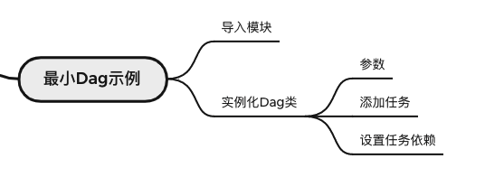
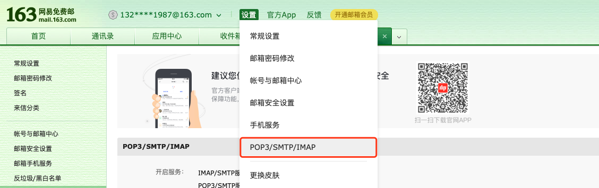
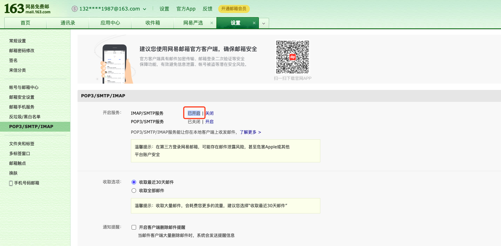
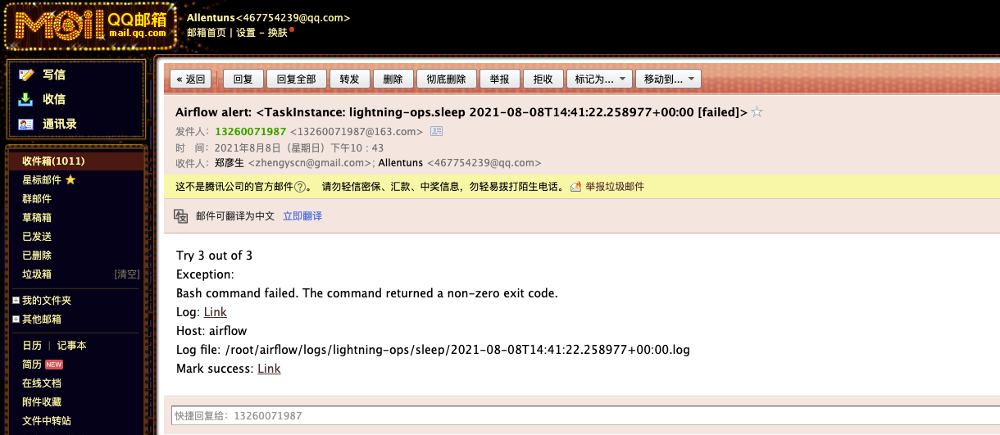
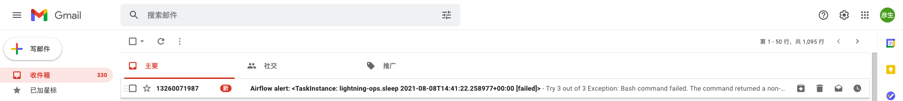
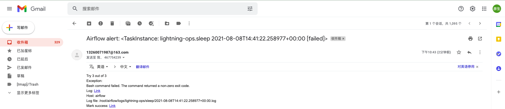

# Airflow 任务调度系统 - 实战


## 5. 快速入门 - （郑 8.9）



### 1. 最小Dag示例

> 文件名: lightning-ops.py

```python
import json
import random
from datetime import timedelta
from textwrap import dedent

# The DAG object; we'll need this to instantiate a DAG
from airflow import DAG

# Operators; we need this to operate!
from airflow.operators.bash import BashOperator
from airflow.operators.python import PythonOperator
from airflow.utils.dates import days_ago
# These args will get passed on to each operator
# You can override them on a per-task basis during operator initialization


# 1. 定义一个字典类型的变量 default_args
# 可以是dag级别 也可以是task级别的
default_args = {
    'owner': 'zhengyansheng',                 				   # Dag的拥有者
    'email': ['zhengyscn@gmail.com', "467754239@qq.com"],    				      # 邮箱接收者
    'email_on_failure': True,            	 				       # 任务失败发邮件
    'email_on_retry': False,              	   					  # 重试发邮件
    'retries': 1,                         			    				    # 重试次数
    'retry_delay': timedelta(minutes=1),  					# 重试间隔
    'queue': 'queue', 				 					  # 默认参数 queue: str = conf.get('operators', 'default_queue')
    # 'priority_weight': 10, 						  					# 优先级权重，数字越大，任务越优先被执行
    # 'execution_timeout': timedelta(seconds=300), 	 	 # 允许执行的最长时间，超过这个时间则抛出异常和失败
    # 'on_failure_callback': some_function,  					# 任务失败时 要回调的函数 一个context参数
    # 'on_success_callback': some_other_function,  		# 任务成功时 要回调的函数 一个context参数
    # 'pool': 'default_pool',  # 默认参数 self.pool = Pool.DEFAULT_POOL_NAME if pool is None else pool, DEFAULT_POOL_NAME = 'default_pool'
}

# 2. with上下文管理器
# 实例化DAG类
with DAG(
    'lightning-ops',
    default_args=default_args,
    description='lightning-ops',     # 描述信息，通过UI查看鼠标放到Dag上可以看到这个字段的描述信息
    schedule_interval=timedelta(days=1),     # 调度周期，明天的这个时间。如果今天是2021-07-04 19:00:00，那么2021-07-05 19:00:00
    start_date=days_ago(2),                  # 调度开始时间，2天前。如果今天是2021-07-04 19:00:00，那么2021-07-02 00:00:00
    tags=['lightning'],                        # 打上tag，通过tag过滤，可以支持打上多个tag
) as dag:

    # t1, t2 and t3 are examples of tasks created by instantiating operators
    t1 = BashOperator(
        task_id='print_date',                # 任务ID，同一个Dag中task_id要唯一
        bash_command='date',                 # 运行的命令
    )

    t2 = BashOperator(
        task_id='sleep',
        depends_on_past=False,               # 如果设置为True，依赖上一个任务的执行成功或者跳过，才能继续，否则终止
        bash_command='sleep 5 x',
        retries=2,                           # 任务失败应重试的次数
    )
    # 格式化输出
    t1.doc_md = dedent(
        """\
    #### Task Documentation
    You can document your task using the attributes `doc_md` (markdown),
    `doc` (plain text), `doc_rst`, `doc_json`, `doc_yaml` which gets
    rendered in the UI's Task Instance Details page.
    

    """
    )

    dag.doc_md = __doc__  # providing that you have a docstring at the beggining of the DAG
    dag.doc_md = """
    This is a documentation placed anywhere
    """  # otherwise, type it like this
    # 一组模版化的脚本
    templated_command = dedent(
        """
    
        echo "{{ ds }}"
        echo "{{ macros.ds_add(ds, 7)}}"
        echo "{{ params.my_param }}"
    
    """
    )

    t3 = BashOperator(
        task_id='templated',
        depends_on_past=False,
        bash_command=templated_command,                # 执行的命令
        params={'my_param': 'Parameter I passed in'},  # 为 bash_command 命令传递参数
    )

    def logic_handler(**context):
        print("entry logic_handler")

        print("context: {}".format(context))
        return ""

    t4 = PythonOperator(
        task_id="random",
        python_callable=logic_handler,
        provide_context=True,
        op_kwargs={'random_base': random.randint(1, 100)},
    )

    # 任务间依赖关系表达式
    t1 >> [t2, t3] >> t4
```


**邮箱通知**


- 开启 163邮箱的 客户端密码（参考 https://note.youdao.com/ynoteshare1/index.html?id=f9fef46114fb922b45460f4f55d96853&type=note）







- airflow.cfg 配置 （vim airflow.cfg）

```bash
[smtp]
# references: https://stackoverflow.com/questions/51829200/how-to-set-up-airflow-send-email
# enable 163 client password: https://note.youdao.com/ynoteshare1/index.html?id=f9fef46114fb922b45460f4f55d96853&type=note

# If you want airflow to send emails on retries, failure, and you want to use
# the airflow.utils.email.send_email_smtp function, you have to configure an
# smtp server here
# smtp_host = localhost

# smtp邮箱地址
smtp_host = smtp.163.com

# 是否tls加密
smtp_starttls = False

# 是否ssl加密
smtp_ssl = True
# Example: smtp_user = airflow
# smtp_user =
smtp_user = 13260071987@163.com
# Example: smtp_password = airflow
# smtp_password =
smtp_password = FUCCFWCGXEFLVDSQ

# smtp端口号
smtp_port = 587

# 发件人邮箱地址，需开通smtp服务
smtp_mail_from = 13260071987@163.com

# 超时时间
smtp_timeout = 3

# 重试次数
smtp_retry_limit = 1
```


- 收到邮件










注意事项

- DAG设置的参数优先级 低于 Task级别设置的优先级；换句话来说 就是 Task级别的参数会覆盖DAG设置的参数。


### 2. 介绍Operator

- BashOperator
  - command
  - Script

- PythonOperator
  - func handle
- DingdingOperator

### 3. 任务间依赖关系

- 方式1

```python
t1 >> [t2, t3] >> t4
```


- 方式2

```python
t1.set_downstream(t2) # t2.set_upstream(t1)
or 
t1.set_downstream([t2, t3])
t4.set_upstream([t2, t3])
```


### 4. 测试

#### 1. 运行

##### 方式1: 直接运行脚本

```bash
# 如果脚本没有引发异常，则意味着Dag是正常的。
python dags/dag_demo.py
```

##### 方式2：执行命令行

- 宿主机

```bash
# 初始化db表
airflow db init

# 列出所有的dag
airflow dags list

# 列出 dag_demo dag下的所有任务
airflow tasks list dag_demo

# 以树的形式列出dag dag_demo 下所有任务
airflow tasks list dag_demo --tree
```


- 容器

```bash
# 首先切换到 docker-compose.yaml 同一级目录
cd deploy

# 初始化db表
./airflow.sh db init

# 列出所有的dag
./airflow.sh dags list

# 列出 dag_demo dag下的所有任务
./airflow.sh tasks list dag_demo

# 以树的方式列出dag dag_demo 下所有任务
./airflow.sh tasks list dag_demo --tree
```


#### 2. 测试

> 执行测试，并不会把状态保存到数据库中。

命令行airflow, 如果要执行容器内命令，可以直接替换成./airflow.sh脚本来执行，两者是等价的。

**Task级别**

```bash
# 语法
# airflow tasks test [dag_id] [task_id] [execution_date]

# 测试任务 print_date
airflow tasks test dag_demo print_date 2015-06-01

# 测试任务 sleep
airflow tasks test dag_demo sleep 2015-06-01

# 测试任务 templated
airflow tasks test dag_demo templated 2015-06-01
```


**Dag级别**

```bash
# 语法
# airflow dags test [dag_id] [execution_date]


# 测试Dag dag_demo
airflow dags test dag_demo 2021-07-01
```


### 5. backfill - 回填

#### 1. 概述

```tex
There can be the case when you may want to run the dag for a specified historical period e.g., A data filling DAG is created with start_date 2019-11-21, but another user requires the output data from a month ago i.e., 2019-10-21. This process is known as Backfill.

You may want to backfill the data even in the cases when catchup is disabled. This can be done through CLI. Run the below command
```


大白话: 把历史未被执行过的任务在指定的时间内执行一遍，如果已经执行过，那么即使 backfill 也不会执行。

#### 2. 语法

```bash
# 在一个指定的日期范围内执行你的回填
airflow dags backfill --start-date START_DATE  --end-date END_DATE dag_id

# airflow dags backfill <dag_id>  --start-date 2015-06-01 --end-date 2015-06-07
# airflow dags backfill <dag_id>  --start-date 2015-06-09 --end-date 2015-06-09
```


### 6. catchup - 追赶

https://airflow.apache.org/docs/apache-airflow/stable/dag-run.html#catchup


**Catchup**

追赶：一个 DAG 带有一个 start_date 参数，可能带一个 end_date 参数，schedule_interval 定义一系列的时间间隔，scheduler 将这些时间间隔转换为 单独运行DAG。

默认情况下，scheduler 程序将在自上次执行日期以来未运行（或已清除）的任何时间间隔内启动 DAG 运行。这个概念称为追赶。


关闭 catchup 功能  一定要关闭这个功能

- 方式1

```python
from airflow.models.dag import DAG
from airflow.operators.bash import BashOperator
from datetime import datetime, timedelta


default_args = {
    'owner': 'airflow',
    'depends_on_past': False,
    'email': ['airflow@example.com'],
    'email_on_failure': False,
    'email_on_retry': False,
    'retries': 1,
    'retry_delay': timedelta(minutes=5)
}

dag = DAG(
    'tutorial',
    default_args=default_args,
    start_date=datetime(2015, 12, 1),
    description='A simple tutorial DAG',
    schedule_interval='@daily',
    catchup=False
)
```

- 方式2

```bash
# grep catchup_by_default airflow.cfg
catchup_by_default = False
```


