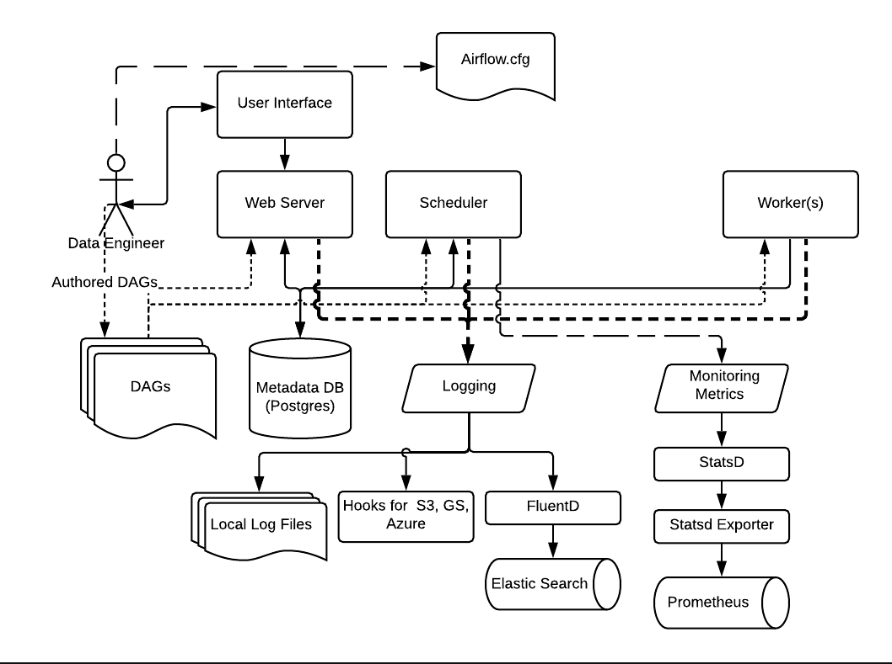
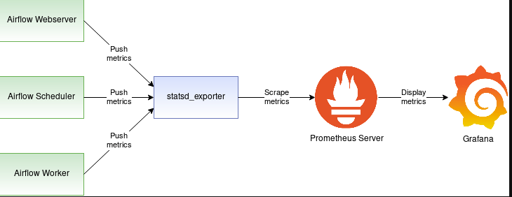

# Airflow 任务调度系统 - 实战

## 8. 日志和监控 - （郑 8.23）

### 1. 架构




默认情况下，Airflow支持日志到本地系统，这些日志包含Web server,，Scheduler，和Workers，这些仅使用于开发环境快速DEBUG。

还可以写入到云存储上，比如AWS, Google Cloud, and Azure，需要更改 airflow.cfg 配置文件均可。

对于生产环境

- 日志搜集，建议使用 Filebeat 捕获日志发送到 ElasticSearch。
- 对于收集指标，建议使用 StatsD 从 Airflow 收集指标并将它们发送到诸如 Prometheus


### 2. 日志配置


日志存放目录: airflow.cfg`使用 `base_log_folder

```bash
# grep base_log_folder airflow.cfg
base_log_folder = /root/airflow/logs
```


日志命名约定： `{dag_id}/{task_id}/{execution_date}/{try_number}.log`

```bash
# ll logs/demo_test/sleep/2021-08-04T00:00:00+00:00
总用量 4
-rw-rw-rw- 1 root root 2472 8月   6 06:32 1.log
```


```bash
// 显示airflow相关的配置信息
# airflow info

// 显示airflow配置文件信息
# airflow config list
```


### 3. 健康检查状态

#### 1. Http 方式

```bash
# curl http://localhost/health
{
  "metadatabase": {
    "status": "healthy"
  },
  "scheduler": {
    "status": "healthy",
    "latest_scheduler_heartbeat": "2021-08-17T22:17:14.872282+00:00"
  }
}
```


#### 2. Cli 方式

- 检查 scheduler 程序存活

```bash
[root@airflow ~]# airflow jobs check
No alive jobs found.
[root@airflow ~]# echo $?
1
[root@airflow ~]# airflow jobs check
Found one alive job.
[root@airflow ~]# echo $?
0
```


- 检查 dataase

```bash
[root@airflow ~]# airflow db check
[2021-08-18 06:33:32,040] {db.py:776} INFO - Connection successful.
[root@airflow ~]# echo $?
0
```


- 检查 Celery cluster

http://139.198.30.33:5555/


- 检查 Celery workers

```bash
]# celery --app airflow.executors.celery_executor.app inspect ping
-> celery@aaa: OK
        pong
-> celery@airflow: OK
        pong
```


#### 3. 总结


服务存活

方式1

- ps -ef | grep -v grep | grep web-server
- ps -ef | grep -v grep | grep scheduler
- netstat -tnlp | grep 80


方式2

- cli
  - webserver
  - sheduler
  - worker
  - database


### 4. 基于Prometheus监控方案




airflow-cluster 1台

montior statsd_exporter prometheus, grafana

#### 1. statsd

##### 1. 安装客户端

> airflow 集群中 scheduler 节点上安装 stats 客户端

```bash
# pip install statsd
```

##### 2. 修改配置文件

```bash
# vim ~/airflow/airflow.cfg 
[metrics]
statsd_on = True
statsd_host = 82.156.188.28
statsd_port = 9125
statsd_prefix = airflow

# 默认发送全部Metrics，可以指定组件的Metrics
# 比如: scheduler,executor,dagrun
#statsd_allow_list = 

# 配置自定义的statsd客户端，并加入到PYTHONPATH当中
# 如果不指定使用默认的
# statsd_custom_client_path =
```

##### 3. 重启调度程序

```bash
airflow scheduler
```


#### 2. statsd_exporter

##### 1. 常规部署

###### 1. 安装

```bash
// 1.17
go env -w GOPROXY=https://goproxy.cn,direct
go env -w GO111MODULE=on

go install github.com/prometheus/statsd_exporter@latest
```

###### 2. 启动

```bash
./go/bin/statsd_exporter --log.level debug
```


```bash
level=info ts=2021-08-19T22:32:45.998Z caller=main.go:321 msg="Starting StatsD -> Prometheus Exporter" version="(version=, branch=, revision=)"
level=info ts=2021-08-19T22:32:45.998Z caller=main.go:322 msg="Build context" context="(go=go1.17, user=, date=)"
level=info ts=2021-08-19T22:32:45.998Z caller=main.go:361 msg="Accepting StatsD Traffic" udp=:9125 tcp=:9125 unixgram=
level=info ts=2021-08-19T22:32:45.998Z caller=main.go:362 msg="Accepting Prometheus Requests" addr=:9102
```


**注意**

监听在 tcp, udp的 9125 端口号上，接收 StatsD 的网络流量。 如果是用的云主机，安全组记得开放端口。

监听在 Prometheus 的请求 9102 端口号上，接收 Prometheus 的网络流量。

###### 3. Browser 访问Metrics


##### 2. 容器部署 - 扩展


###### 1. 配置statsd_mapping.yml

https://raw.githubusercontent.com/databand-ai/airflow-dashboards/main/statsd/statsd.conf

```bash
mappings:
  # Airflow StatsD metrics mappings (https://airflow.apache.org/docs/apache-airflow/stable/logging-monitoring/metrics.html)
  # === Counters ===
  - match: "(.+)\\.(.+)_start$"
    match_metric_type: counter
    name: "af_agg_job_start"
    match_type: regex
    labels:
      airflow_id: "$1"
      job_name: "$2"
  - match: "(.+)\\.(.+)_end$"
    match_metric_type: counter
    name: "af_agg_job_end"
    match_type: regex
    labels:
      airflow_id: "$1"
      job_name: "$2"
  - match: "(.+)\\.operator_failures_(.+)$"
    match_metric_type: counter
    name: "af_agg_operator_failures"
    match_type: regex
    labels:
      airflow_id: "$1"
      operator_name: "$2"
  - match: "(.+)\\.operator_successes_(.+)$"
    match_metric_type: counter
    name: "af_agg_operator_successes"
    match_type: regex
    labels:
      airflow_id: "$1"
      operator_name: "$2"
  - match: "*.ti_failures"
    match_metric_type: counter
    name: "af_agg_ti_failures"
    labels:
      airflow_id: "$1"
  - match: "*.ti_successes"
    match_metric_type: counter
    name: "af_agg_ti_successes"
    labels:
      airflow_id: "$1"
  - match: "*.zombies_killed"
    match_metric_type: counter
    name: "af_agg_zombies_killed"
    labels:
      airflow_id: "$1"
  - match: "*.scheduler_heartbeat"
    match_metric_type: counter
    name: "af_agg_scheduler_heartbeat"
    labels:
      airflow_id: "$1"
  - match: "*.dag_processing.processes"
    match_metric_type: counter
    name: "af_agg_dag_processing_processes"
    labels:
      airflow_id: "$1"
  - match: "*.scheduler.tasks.killed_externally"
    match_metric_type: counter
    name: "af_agg_scheduler_tasks_killed_externally"
    labels:
      airflow_id: "$1"
  - match: "*.scheduler.tasks.running"
    match_metric_type: counter
    name: "af_agg_scheduler_tasks_running"
    labels:
      airflow_id: "$1"
  - match: "*.scheduler.tasks.starving"
    match_metric_type: counter
    name: "af_agg_scheduler_tasks_starving"
    labels:
      airflow_id: "$1"
  - match: "*.scheduler.orphaned_tasks.cleared"
    match_metric_type: counter
    name: "af_agg_scheduler_orphaned_tasks_cleared"
    labels:
      airflow_id: "$1"
  - match: "*.scheduler.orphaned_tasks.adopted"
    match_metric_type: counter
    name: "af_agg_scheduler_orphaned_tasks_adopted"
    labels:
      airflow_id: "$1"
  - match: "*.scheduler.critical_section_busy"
    match_metric_type: counter
    name: "af_agg_scheduler_critical_section_busy"
    labels:
      airflow_id: "$1"
  - match: "*.sla_email_notification_failure"
    match_metric_type: counter
    name: "af_agg_sla_email_notification_failure"
    labels:
      airflow_id: "$1"
  - match: "*.ti.start.*.*"
    match_metric_type: counter
    name: "af_agg_ti_start"
    labels:
      airflow_id: "$1"
      dag_id: "$2"
      task_id: "$3"
  - match: "*.ti.finish.*.*.*"
    match_metric_type: counter
    name: "af_agg_ti_finish"
    labels:
      airflow_id: "$1"
      dag_id: "$2"
      task_id: "$3"
      state: "$4"
  - match: "*.dag.callback_exceptions"
    match_metric_type: counter
    name: "af_agg_dag_callback_exceptions"
    labels:
      airflow_id: "$1"
  - match: "*.celery.task_timeout_error"
    match_metric_type: counter
    name: "af_agg_celery_task_timeout_error"
    labels:
      airflow_id: "$1"

  # === Gauges ===
  - match: "*.dagbag_size"
    match_metric_type: gauge
    name: "af_agg_dagbag_size"
    labels:
      airflow_id: "$1"
  - match: "*.dag_processing.import_errors"
    match_metric_type: gauge
    name: "af_agg_dag_processing_import_errors"
    labels:
      airflow_id: "$1"
  - match: "*.dag_processing.total_parse_time"
    match_metric_type: gauge
    name: "af_agg_dag_processing_total_parse_time"
    labels:
      airflow_id: "$1"
  - match: "*.dag_processing.last_runtime.*"
    match_metric_type: gauge
    name: "af_agg_dag_processing_last_runtime"
    labels:
      airflow_id: "$1"
      dag_file: "$2"
  - match: "*.dag_processing.last_run.seconds_ago.*"
    match_metric_type: gauge
    name: "af_agg_dag_processing_last_run_seconds"
    labels:
      airflow_id: "$1"
      dag_file: "$2"
  - match: "*.dag_processing.processor_timeouts"
    match_metric_type: gauge
    name: "af_agg_dag_processing_processor_timeouts"
    labels:
      airflow_id: "$1"
  - match: "*.executor.open_slots"
    match_metric_type: gauge
    name: "af_agg_executor_open_slots"
    labels:
      airflow_id: "$1"
  - match: "*.executor.queued_tasks"
    match_metric_type: gauge
    name: "af_agg_executor_queued_tasks"
    labels:
      airflow_id: "$1"
  - match: "*.executor.running_tasks"
    match_metric_type: gauge
    name: "af_agg_executor_running_tasks"
    labels:
      airflow_id: "$1"
  - match: "*.pool.open_slots.*"
    match_metric_type: gauge
    name: "af_agg_pool_open_slots"
    labels:
      airflow_id: "$1"
      pool_name: "$2"
  - match: "*.pool.queued_slots.*"
    match_metric_type: gauge
    name: "af_agg_pool_queued_slots"
    labels:
      airflow_id: "$1"
      pool_name: "$2"
  - match: "*.pool.running_slots.*"
    match_metric_type: gauge
    name: "af_agg_pool_running_slots"
    labels:
      airflow_id: "$1"
      pool_name: "$2"
  - match: "*.pool.starving_tasks.*"
    match_metric_type: gauge
    name: "af_agg_pool_starving_tasks"
    labels:
      airflow_id: "$1"
      pool_name: "$2"
  - match: "*.smart_sensor_operator.poked_tasks"
    match_metric_type: gauge
    name: "af_agg_smart_sensor_operator_poked_tasks"
    labels:
      airflow_id: "$1"
  - match: "*.smart_sensor_operator.poked_success"
    match_metric_type: gauge
    name: "af_agg_smart_sensor_operator_poked_success"
    labels:
      airflow_id: "$1"
  - match: "*.smart_sensor_operator.poked_exception"
    match_metric_type: gauge
    name: "af_agg_smart_sensor_operator_poked_exception"
    labels:
      airflow_id: "$1"
  - match: "*.smart_sensor_operator.exception_failures"
    match_metric_type: gauge
    name: "af_agg_smart_sensor_operator_exception_failures"
    labels:
      airflow_id: "$1"
  - match: "*.smart_sensor_operator.infra_failures"
    match_metric_type: gauge
    name: "af_agg_smart_sensor_operator_infra_failures"
    labels:
      airflow_id: "$1"

  # === Timers ===
  - match: "*.dagrun.dependency-check.*"
    match_metric_type: observer
    name: "af_agg_dagrun_dependency_check"
    labels:
      airflow_id: "$1"
      dag_id: "$2"
  - match: "*.dag.*.*.duration"
    match_metric_type: observer
    name: "af_agg_dag_task_duration"
    labels:
      airflow_id: "$1"
      dag_id: "$2"
      task_id: "$3"
  - match: "*.dag_processing.last_duration.*"
    match_metric_type: observer
    name: "af_agg_dag_processing_duration"
    labels:
      airflow_id: "$1"
      dag_file: "$2"
  - match: "*.dagrun.duration.success.*"
    match_metric_type: observer
    name: "af_agg_dagrun_duration_success"
    labels:
      airflow_id: "$1"
      dag_id: "$2"
  - match: "*.dagrun.duration.failed.*"
    match_metric_type: observer
    name: "af_agg_dagrun_duration_failed"
    labels:
      airflow_id: "$1"
      dag_id: "$2"
  - match: "*.dagrun.schedule_delay.*"
    match_metric_type: observer
    name: "af_agg_dagrun_schedule_delay"
    labels:
      airflow_id: "$1"
      dag_id: "$2"
  - match: "*.scheduler.critical_section_duration"
    match_metric_type: observer
    name: "af_agg_scheduler_critical_section_duration"
    labels:
      airflow_id: "$1"
  - match: "*.dagrun.*.first_task_scheduling_delay"
    match_metric_type: observer
    name: "af_agg_dagrun_first_task_scheduling_delay"
    labels:
      airflow_id: "$1"
      dag_id: "$2"
```


###### 2. 启动容器

```bash
docker pull prom/statsd-exporter

docker run -d -p 9103:9102 -p 9126:9125 -p 9126:9125/udp \
        -v $PWD/statsd_mapping.yml:/tmp/statsd_mapping.yml \
        prom/statsd-exporter --statsd.mapping-config=/tmp/statsd_mapping.yml
```


#### 3. 部署prometheus

##### 1. 安装

```bash
wget https://github.com/prometheus/prometheus/releases/download/v2.29.1/prometheus-2.29.1.linux-amd64.tar.gz
tar xf prometheus-2.29.1.linux-amd64.tar.gz
mv prometheus-2.29.1.linux-amd64 /usr/local/prometheus
cd /usr/local/prometheus
```

##### 2. 配置

```bash
# vim prometheus.yml
# my global config
global:
  scrape_interval: 15s # Set the scrape interval to every 15 seconds. Default is every 1 minute.
  evaluation_interval: 15s # Evaluate rules every 15 seconds. The default is every 1 minute.
  # scrape_timeout is set to the global default (10s).

# Alertmanager configuration
alerting:
  alertmanagers:
    - static_configs:
        - targets:
          # - alertmanager:9093

# Load rules once and periodically evaluate them according to the global 'evaluation_interval'.
rule_files:
  # - "first_rules.yml"
  # - "second_rules.yml"

# A scrape configuration containing exactly one endpoint to scrape:
# Here it's Prometheus itself.
scrape_configs:
  # The job name is added as a label `job=<job_name>` to any timeseries scraped from this config.
  - job_name: "prometheus"

    # metrics_path defaults to '/metrics'
    # scheme defaults to 'http'.

    static_configs:
      - targets: ["localhost:9090"]

  - job_name: airflow
    static_configs:
      - targets: ['82.156.188.28:9102']
   
```

##### 3. 启动

```bash
prometheus --config.file prometheus.yml
```


##### 4. Prometheus 界面 Targets

> 默认监听在 9090 端口号上


#### 4. 部署Grafana

> admin/ admin


##### 1. 安装

```bash
docker run -d -p 3000:3000 --name grafana grafana/grafana:7.1.5
```

##### 2. 导入 dashboard 配置


##### 3. Dashboard展示

> 可以自行修改 Dashboard 配置, 使其展示更多指标.


