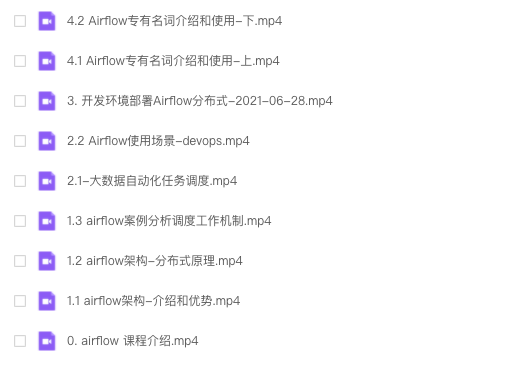

# apache-airflow 技术中文视频

---

付费视频已发布的平台：
- [腾讯课堂](https://ke.qq.com/course/3583340?taid=12330035066613100)
- 51CTO
- 慕课网

免费视频已发布的平台
- [B站](https://www.bilibili.com/video/BV1gy4y1M7Bt)

---

## 视频

- [第0课时 课程介绍]() 
- [第1课时 架构&&组件&&案例分析]()
- 第2课时 使用场景
  - [2.1 大数据自动化]()
  - [2.2 运维自动化]()
- [第3课时 apache-airflow 任务调度系统 - 开发环境-快速部署的2种方式]()
- 第4课时 专有名词解释和使用
  - [4.1 DAG, Task, Pipeline, Xcoms, Variables, DagRun]()
  - [4.2 Macros, Connections, Hook, Pools, priority_weight]()
- [第5课时 快速入门]()
- [第6课时 深入定时策略]() 
- 第7课时 全面学习admin UI使用 [上传中]
- 第8课时 日志和监控 [录制中]
- 第9课时 安全 [准备中]
- 第10课时 定制化通知媒介，邮件，短信，钉钉 [录制中]
- 第11课时 2.x 新特性  [录制中]
- 第12课时 scheduler高可用工作原理 [录制中]
- 第13课时 大数据自动化工作流 - 性能优化和测试 [录制中]
- 第14课时 
- 第15课时 
- 第16课时 
- 第17课时 
- 第18课时 
- 第19课时 
- 第20课时 
- 第21课时 
- 第22课时 
- 第23课时 
- 第24课时
- 第25课时 
- ...

## 课程更新进度

## 全套课程

## 招聘

欢迎志同道合之人，一起协力做 免费 + 付费视频教程，让社区成长更快。

