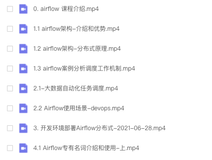

# apache-airflow 技术中文视频

## 视频

- [第1课时 课程介绍]()
- 第2课时 使用场景
  - [2.1 大数据自动化]()
  - [2.2 运维自动化]()
- [第3课时 apache-airflow 任务调度系统 - 开发环境-快速部署的2种方式](https://www.bilibili.com/video/BV1gy4y1M7Bt)
- 第4课时 专有名词解释和使用
  - [4.1 DAG, Task, Pipeline, Xcoms, Variables, DagRun]()
  - [4.2 Macros, Connections, Hook, Pools, priority_weight]()
- [快速入门](https://ke.qq.com/course/package/37511?tuin=31589b0e)

## 课程更新进度

## 全套课程

> 1wDAG数量级优化之路

## 招聘

欢迎志同道合之人，一起协力做 免费 + 付费视频教程，让社区成长更快。

